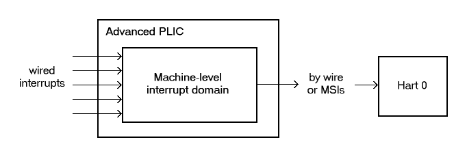
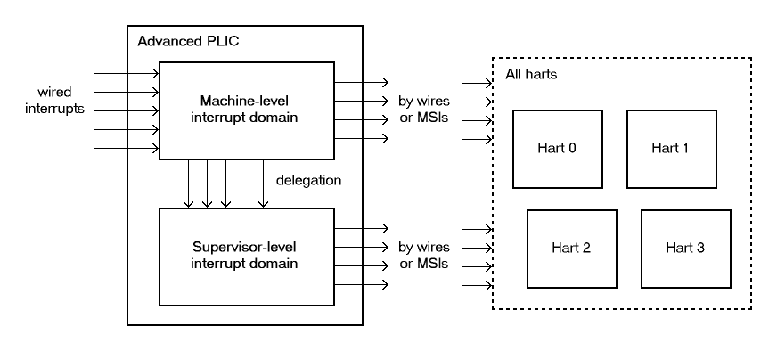
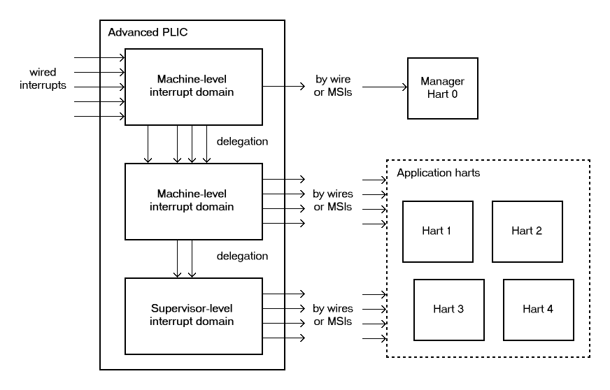

[[AdvPLIC]]
== Advanced Platform-Level Interrupt Controller (APLIC)

In a RISC-V system, a Platform-Level Interrupt Controller (PLIC) handles
external interrupts that are signaled through wires rather than by MSIs.
When the RISC-V harts in a system do not have IMSICs, the harts themselves do
not support MSIs, and all external interrupts to such harts must pass
through a PLIC. But even in machines where harts have IMSICs and most
interrupts are communicated via MSIs, it is not unusual for some device
interrupts still to be signaled by dedicated wires. In particular, for
devices (or device controllers) that do not otherwise need to initiate
bus transactions in the system, the cost of supporting MSIs is
especially high, so wired interrupts are a frugal alternative. Wired
interrupts also continue to be universally supported by all current
computer platforms, unlike MSIs, making another reason for many
commodity devices or controllers to choose wired interrupts over MSIs,
unless implementing a standard like PCI Express that dictates MSIs.

This chapter specifies an _Advanced PLIC_ (APLIC) that is not backward
compatible with the earlier RISC-V PLIC. Full conformance to the Advanced
Interrupt Architecture requires the APLIC. However, a workable system
can be built substituting the older PLIC instead, assuming only wired
interrupts to harts, not MSIs.

[NOTE]
====
We intend eventually to provide a free example parameterized
implementation of an APLIC, written in portable SystemVerilog, that we
expect will be suitable for many systems without modification.

'''

A draft specification exists for a _Duo-PLIC_ that is
software-configurable to act as either an original PLIC or an APLIC.
However, at this time, it appears unlikely that the International
Association will ever ratify the Duo-PLIC specification as a standard.
====

In a machine without IMSICs, every RISC-V hart accepts interrupts from exactly one PLIC or APLIC that is the _external interrupt controller_ for that
hart. A hart’s external interrupt controller (the PLIC or APLIC) signals
interrupts to the hart through a dedicated connection, usually a wire,
for each privilege level that the hart may receive interrupts. (Recall
<<intrsWithoutIMSICs>>). A
system without IMSICs will typically have only one PLIC or APLIC,
serving as the external interrupt controller for all RISC-V harts.

[NOTE]
====
Because every RISC-V hart without an IMSIC has exactly one PLIC or APLIC as its
external interrupt controller, a system with multiple APLICs must
partition the harts into disjoint subsets, making each APLIC the
external interrupt controller for a separate subset of the harts. While
not prohibited, this arrangement is likely to be less efficient than
having all harts share a single APLIC.
====

RISC-V harts that employ IMSICs as their external interrupt controllers can
receive external interrupts only in the form of MSIs. In that case, the
role of an APLIC is to convert wired interrupts into MSIs for harts.
(Recall <<intrsWithIMSICs>>.)
The APLIC is said to _forward_ incoming wire-signaled interrupts to
harts by sending MSIs to the harts.

When harts have IMSICs to support MSIs, a system may easily contain
multiple APLICs for converting wired interrupts into MSIs, with each
APLIC forwarding interrupts from a different subset of devices. Multiple
APLICs are presumably more likely to arise when groups of devices are
physically distant from one another, perhaps even on separate chips
(including chiplets in a multi-chip module).

=== Interrupt sources and identities

An individual APLIC supports a fixed number of _interrupt sources_,
corresponding exactly with the set of physical incoming interrupt wires
at the APLIC. Most often, each source’s incoming wire is connected to
the output interrupt wire from a single device or device controller.
(For level-sensitive interrupts, the interrupt outputs of multiple
devices or controllers may be combined to drive the incoming wire of a
single interrupt source at an APLIC. An interrupt source’s incoming wire
might also be simply tied high or low, if, for example, the source will
always be configured as Detached. See
<<AdvPLIC-reg-sourcecfg>> for a description of _source
modes_.)

Each of an APLIC's interrupt sources has a fixed unique _identity
number_ in the range 1 to latexmath:[$N$], where latexmath:[$N$] is the
total number of sources at the APLIC. The number zero is not a valid
interrupt identity number at an APLIC. The maximum number of interrupt
sources an APLIC may support is 1023.

When an APLIC delivers interrupts directly to harts at a given privilege
level (rather than forwarding interrupts as MSIs), the APLIC is the
external interrupt controller for the harts at that privilege level, and
the interrupt identities at the APLIC become directly the _minor
identities_ for external interrupts at the harts.

On the other hand, when an APLIC forwards interrupts by MSIs, software
configures a new interrupt identity number for the outgoing MSIs of each
source. Consequently, in this case, the source identity numbers at a
given APLIC only distinguish the incoming interrupts at the APLIC and
have no relevance outside the APLIC.

=== Interrupt domains

An APLIC supports one or more _interrupt domains_, each associated with
a subset of harts at one privilege level (machine or supervisor level).
The harts within an interrupt domain are those that the domain can
interrupt at the corresponding privilege level. Each domain has its own
memory-mapped control region in the machine’s address space that appears
to control a complete, separate APLIC, though in fact all domain
interfaces together access a single combined interrupt controller.

<<AdvPLIC-ex-1Domain>> through
<<AdvPLIC-ex-3Domains>> depict some possible hierarchies of
interrupt domains implemented by an APLIC in a system.

The first figure represents a minimal system that has a single hart not
supporting supervisor mode, with a single interrupt domain for machine
level on that hart. The next figure, <<AdvPLIC-ex-2Domains>>,
shows a basic arrangement for a larger system designed for symmetric
multiprocessing (SMP), with multiple harts that all implement supervisor
mode. In such cases, the APLIC will usually provide a separate interrupt
domain for supervisor level, as the figure portrays. This
supervisor-level interrupt domain allows an operating system, running in
S-mode on the multiple harts, to have direct control over the interrupts
it receives, avoiding the need to call upon M-mode to exercise that
control.

[[AdvPLIC-ex-1Domain]]
.Example of a system that has a single hart implementing only M-mode, with a single machine-level interrupt domain for that hart. 

An APLIC's interrupt domains are arranged in a tree hierarchy, with the
root domain always being at machine level. Incoming interrupt wires
arrive first at the root domain. Each domain may then selectively
delegate all or a subset of interrupt sources to its child domains in
the hierarchy. Within a given APLIC, interrupt source numbers are
invariant across all domains, so source identity number latexmath:[$i$]
always refers to the same source in every domain, corresponding to
incoming wire number latexmath:[$i$]. For an interrupt domain below the
root, interrupt sources not delegated down to that domain appear to the
domain as being not implemented.

<<AdvPLIC-ex-3Domains>> shows a hierarchy of three
interrupt domains, two at machine level and one at supervisor level. The
arrangement in the figure, when combined with PMP (physical memory
protection), allows machine-level software to isolate a selection of
interrupts exclusively for hart 0, beyond the reach of the four
application harts, even at machine level.

[[AdvPLIC-ex-2Domains]]
.An example system with four harts implement M-mode and S-mode, with two APLIC interrupt domains, one each for machine and supervisor levels. 

[[AdvPLIC-ex-3Domains]]
.A RISC-V system that extends the example of <<AdvPLIC-ex-2Domains>> with a fifth M-mode-only "manager" hart, with a separate machine-level interrupt domain above the other domains. 

[NOTE]
====
In order for the harts within an interrupt domain to have direct control
over the interrupts from the domain, the harts must be cooperatively
controlled by software at the same privilege level. In particular, a
single operating system should control all of the harts associated with
a supervisor-level interrupt domain. In the examples of <<AdvPLIC-ex-2Domains>> and <<AdvPLIC-ex-3Domains>>, control
of the APLIC's supervisor-level interrupt domain could not be safely
split among multiple independent OSes.

Given the domain hierarchies depicted in the figures, if it were
necessary to partition the application harts for multiple OSes,
machine-level software would need to prevent direct OS access to the
supervisor-level interrupt domain and instead provide SBI services for
controlling APLIC interrupts or, alternatively, emulate the control
interfaces of separate supervisor-level interrupt domains, one for each
OS. Note that such emulation might still make use of the APLIC's
physical supervisor-level interrupt domain, but under the control of
machine-level software.
====

An APLIC's interrupt domain hierarchy satisfies these rules:

* The root domain is at machine level.
* The parent of any supervisor-level interrupt domain is a machine-level
domain that includes at least the same harts (but at machine level,
obviously). The parent domain may have a larger set of harts at machine
level.
* For each interrupt domain, interrupts from the domain are signaled to
harts all by the same method, either by wire or by MSIs, not by a
mixture of methods among the harts.

When a RISC-V hart's external interrupt controller is an APLIC, not an IMSIC,
the hart can be within only one interrupt domain of this APLIC at each
privilege level.

On the other hand, a hart that has an IMSIC for its external interrupt
controller may, at each privilege level, be in multiple APLIC interrupt
domains, even those of the same APLIC, and may potentially receive MSIs
from multiple different APLICs in the machine.

A platform might give software a way to choose between multiple
interrupt domain hierarchies for any given APLIC. Any such
configurability is outside the scope of this specification, but should
be available to machine level only.

=== Hart index numbers

Within a given interrupt domain, each of the domain’s harts has a unique
_index number_ in the range 0 to latexmath:[${{2}^{14}-{1}}$]
(= 16,383). The index number a domain associates with a hart may or may
not have any relationship to the unique hart identifier ("hart ID")
that the RISC-V Privileged Architecture assigns to the hart. Two different
interrupt domains may employ entirely different index numbers for the
same set of harts. However, if any of an APLIC's interrupt domains can
forward interrupts by MSI, then all machine-level domains of the APLIC
share a common mapping of index numbers to harts.

[NOTE]
====
For efficiency, implementations should prefer small integers for hart
index numbers.
====

=== Overview of interrupt control for a single domain

Each interrupt domain implemented by an APLIC has its own separate
physical control interface that is memory-mapped in the machine’s
address space, allowing access to each domain to be easily regulated by
both PMP (physical memory protection) and page-based address
translation. The control interfaces of all interrupt domains have a
common structure. In most respects, every domain appears to software as
though it were a root domain, without visibility of the domains above it
in the hierarchy.

An individual interrupt domain has the following components for each
interrupt source at the APLIC:

* Source configuration. This determines whether the specific source is
active in the domain and, if so, how the incoming wire is to be
interpreted, such as level-sensitive or edge-sensitive. For a source
that is inactive in the domain, source configuration controls any
delegation to a child domain.
* Interrupt-pending and interrupt-enable bits. For an inactive source,
these two bits are read-only zeros. Otherwise, the pending bit records
an interrupt that arrived and has not yet been signaled or forwarded,
while the enable bit determines whether interrupts from this source
should currently be delivered, or should remain pending.
* Target selection. For an active source, target selection determines
the hart to receive the interrupt and either the interrupt's priority or
the new interrupt identity when forwarding as an MSI.

For interrupt domains that deliver interrupts directly to harts rather
than forwarding by MSIs, the domain has a final set of components for
controlling interrupt delivery to harts, one instance per hart in the
domain.

[NOTE]
====
Although an APLIC with multiple interrupt domains may appear to
duplicate the per-source state listed above (source configuration,
etc.) by a factor equal to the number of domains, in fact, APLIC
implementations can exploit the fact that each source is ultimately
active in only one domain. In all domains to which a specific interrupt
source has not been delegated, the state associated with the source
appears as read-only zeros, requiring no physical register bits.
====

[[AdvPLIC-domainControlRegion]]
=== Memory-mapped control region for an interrupt domain

For each interrupt domain that an APLIC supports, there is a dedicated
memory-mapped control region for managing interrupts in that domain.
This control region is a multiple of 4 KiB in size and aligned to a
4-KiB address boundary. The smallest valid control region is 16 KiB. An
interrupt domain's control region is populated by a set of 32-bit
registers. The first 16 KiB contains the registers listed in
<<TableAdvPLIC-domainControlRegion>>.

[[TableAdvPLIC-domainControlRegion]]
.The registers of the first 16 KiB of an interrupt domain's memory-mapped control region.
[%autowidth,float="center",align="center",cols="^,<,<,<",grid=none,frame=none]
|===
|offset | size |register name |
|`0x0000` |4 bytes |`domaincfg` |
|`0x0004` |4 bytes |`sourcecfg[1]` |
|`0x0008` |4 bytes |`sourcecfg[2]` |
|… | | … |
|`0x0FFC` |4 bytes |`sourcecfg[1023]` |
|`0x1BC0` |4 bytes |`mmsiaddrcfg` |(machine-level interrupt domains only)
|`0x1BC4` |4 bytes |`mmsiaddrcfgh` |”
|`0x1BC8` |4 bytes |`smsiaddrcfg` |”
|`0x1BCC` |4 bytes |`smsiaddrcfgh` |”
|`0x1C00` |4 bytes |`setip[0]` |
|`0x1C04` |4 bytes |`setip[1]` |
|… | | … |
|`0x1C7C` |4 bytes |`setip[31]` |
|`0x1CDC` |4 bytes |`setipnum` |
|`0x1D00` |4 bytes |`in clrip[0]` |
|`0x1D04` |4 bytes |`in clrip[1]` |
|… | | … |
|`0x1D7C` |4 bytes |`in clrip[31]` |
|`0x1DDC` |4 bytes |`clripnum` |
|`0x1E00` |4 bytes |`setie[0]` |
|`0x1E04` |4 bytes |`setie[1]` |
|… | | … |
|`0x1E7C` |4 bytes |`setie[31]` |
|`0x1EDC` |4 bytes |`setienum` |
|`0x1F00` |4 bytes |`clrie[0]` |
|`0x1F04` |4 bytes |`clrie[1]` |
|… | | … |
|`0x1F7C` |4 bytes |`setie[31]` |
|`0x1FDC` |4 bytes |`clrienum` |
|`0x2000` |4 bytes |`setipnum le` |
|`0x2004` |4 bytes |`setipnum be` |
|`0x3000` |4 bytes |`genmsi` |
|`0x3004` |4 bytes |`target[1]` |
|`0x3008` |4 bytes |`target[2]` |
|… | | … |
|`0x3FFC` |4 bytes |`target[1023]` |
|===

Starting at offset `0x4000`, an interrupt domain's control region may optionally
have an array of _interrupt delivery control_ (IDC) structures, one for
each potential hart index number in the range 0 to some maximum that is
at least as large as the maximum hart index number for the interrupt
domain. IDC structures are used only when the domain is configured to
deliver interrupts directly to harts instead of being forwarded by MSIs.
An interrupt domain that supports only interrupt forwarding by MSIs and
not the direct delivery of interrupts by the APLIC does not need IDC
structures in its control region.

The first IDC structure, if any, is for the hart with index number 0;
the second is for the hart with index number 1; and so forth. Each IDC
structure is 32 bytes and has these defined registers:

[%autowidth,float="center",align="center",cols="^,<,<",grid=none,frame=none]
|===
|offset | size |register name 
|`0x00` |4 bytes |`idelivery` 
|`0x04` |4 bytes |`iforce` 
|`0x08` |4 bytes |`ithreshold` 
|`0x18` |4 bytes |`topi`
|`ox1C` |4 bytes |`claimi`
|===

IDC structures are packed contiguously, 32 bytes per structure, so the
offset from the beginning of an interrupt domain's control region to its
second IDC structure (hart index 1), if it exists, is `0x4020`; the offset to
the third IDC structure (hart index 2), if it exists, is `0x4040`; etc.

The array of IDC structures may include some for _potential_ hart index
numbers that are not _actual_ hart index numbers in the domain. For
example, the first IDC structure is always for hart index 0, but 0 is
not necessarily a valid index number for any hart in the domain. For
each IDC structure in the array that does not correspond to a valid hart
index number in the domain, the IDC structure's registers may (or may
not) be all read-only zeros.

Aside from the registers in
<<TableAdvPLIC-domainControlRegion>>
and those listed above for IDC structures, all other bytes in an
interrupt domain's control region are reserved and are implemented as
read-only zeros.

Only naturally aligned 32-bit simple reads and writes are supported
within an interrupt domain's control region. Writes to read-only bytes
are ignored. For other forms of accesses (other sizes, misaligned
accesses, or AMOs), implementations should preferably report an access
fault or bus error but must otherwise ignore the access.

The registers of the first 16 KiB of an interrupt domain's control
region (all but the IDC structures) are documented individually below.
IDC structures are documented later, in
<<AdvPLIC-directMode>>, "Interrupt delivery directly by
the APLIC."

[[AdvPLIC-reg-domaincfg]]
==== Domain configuration (`domaincfg`)

The `domaincfg` register has this format:

[%autowidth,float="center",align="center",cols="<,<",grid=none,frame=none]
|===
|bits 31:24 |read-only 0x80 
|bit 8|IE 
|bit 7|read-only 0
|bit 2 |DM (*WARL*)
|bit 0 |BE (*WARL*)
|===

All other register bits are reserved and read as zeros.

Bit IE (Interrupt Enable) is a global enable for all active interrupt
sources at this interrupt domain. Only when IE = 1 are
pending-and-enabled interrupts actually signaled or forwarded to harts.

Field DM (Delivery Mode) is *WARL* and determines how this interrupt domain
delivers interrupts to harts. The two possible values for DM are:

[%autowidth,float="center",align="center",cols=">,<",grid=none,frame=none]
|===
|0 = |direct delivery mode 
|1 =|MSI delivery mode
|===

In _direct delivery mode_, interrupts are prioritized and signaled
directly to harts by the APLIC itself. In _MSI delivery mode_,
interrupts are forwarded by the APLIC as MSIs to harts, presumably for
further handling by IMSICs at those harts. A given APLIC implementation
may support either or both of these delivery modes for each interrupt
domain.

If the interrupt domain's harts have IMSICs, then unless the relevant
interrupt files of those IMSICs support value `0x40000000` for register `eidelivery`, setting DM
to zero (direct delivery mode) will have the same effect as setting IE
to zero. See <<IMSIC-reg-eidelivery>>
and <<AdvPLIC-directMode-intrDelivery>>.

BE (Big-Endian) is a *WARL* field that determines the byte order for most
registers in the interrupt domain's memory-mapped control region. If
BE = 0, byte order is little-endian, and if BE = 1, it is big-endian.
For RISC-V systems that support only little-endian, BE may be read-only zero,
and for those that support only big-endian, BE may be read-only one. For
bi-endian systems, BE is writable.

Field BE affects the byte order of accesses to the `domaincfg` register itself, just
as for other registers in the interrupt domain’s control region. To deal
with this fact, the read-only value in `domaincfg’s` most-significant byte, bits
31:24, serves two purposes. First, for any read of `domaincfg`, the register's correct byte order is easily determined from the four-byte value
obtained: When interpreted in the correct byte order, bit 31 is one, and
in the wrong order, bit 31 is zero. Second, if the value of BE is
uncertain (prior to software initializing the interrupt domain,
presumably), an 8-bit value latexmath:[$x$] can be safely written to `domaincfg` by writing (latexmath:[$x$]  24) latexmath:[$x$], where <<24 represents
shifting left by 24 bits, and the vertical bar (|) represents bitwise
logical OR. After `domaincfg` is written once, the value of BE should then be known,
so subsequent writes should not need to repeat the same trick.

At system reset, all writable bits in `domaincfg` are initialized to zero,
including IE. If an implementation supports additional forms of reset
for the APLIC, it is implementation-defined (or possibly
platform-defined) how these other resets may affect `domaincfg`.

[[AdvPLIC-reg-sourcecfg]]
====  Source configurations (`sourcecfg[1]–sourcecfg[1023]`) 

For each possible interrupt source latexmath:[$i$], register `sourcecfg[latexmath:[$i$]]` controls
the _source mode_ for source latexmath:[$i$] in this interrupt domain as
well as any delegation of the source to a child domain. When
source latexmath:[$i$] is not implemented, or appears in this domain not
to be implemented, `sourcecfg[latexmath:[$i$]]` is read-only zero. If source latexmath:[$i$] was not
delegated to this domain and is then changed (at the parent domain) to
become delegated to this domain, `sourcecfg[latexmath:[$i$]]` remains zero until successfully written with a nonzero value.

Bit 10 of `sourcecfg[latexmath:[$i$]]` is a 1-bit field called D (Delegate). If D = 1,
source latexmath:[$i$] is delegated to a child domain, and if D = 0, it
is not delegated to a child domain. Interpretation of the rest of `sourcecfg[latexmath:[$i$]]` depends on field D.

When interrupt source latexmath:[$i$] is delegated to a child domain, `sourcecfg[latexmath:[$i$]]` has this format:

[%autowidth,float="center",align="center",cols="<,<",grid=none,frame=none]
|===
|bit 10 |D, =1 
|bits 9:0 |Child Index (*WLRL*)
|===

All other register bits are reserved and read as zeros.

Child Index is a *WLRL* field that specifies the interrupt domain to which this
source is delegated. For an interrupt domain with latexmath:[$C$] child
domains, this field must be able to hold integer values in the range 0
to latexmath:[${C-{1}}$]. Each interrupt domain has a fixed mapping
from these index numbers to child domains.

If an interrupt domain has no children in the domain hierarchy, bit D
cannot be set to one in any `sourcecfg` register for that domain. For such a leaf
domain, attempting to write a `sourcecfg` register with a value that has bit 10 = 1 causes the entire register to be set to zero instead.

When interrupt source latexmath:[$i$] is not delegated to a child
domain `sourcecfg[latexmath:[$i$]]`, has this format:

[%autowidth,float="center",align="center",cols="<,<",grid=none,frame=none]
|===
|bit 10 |D, =0 
|bits 2:0 |SM (*WARL*)
|===

All other register bits are reserved and read as zeros.

The SM (Source Mode) field is *WARL* and controls whether the interrupt source
is active in this domain, and if so, what values or transitions on the
incoming wire are interpreted as interrupts. The values allowed for SM
and their meanings are listed in
<<TableAdvPLIC-sourcecfg-SM>>. Inactive
(zero) is always supported for field SM. Implementations are free to
choose, independently for each interrupt source, what other values are
supported for SM.

[[TableAdvPLIC-sourcecfg-SM]]
.Encoding of the SM (Source Mode) field of a sourcecfg register when bit D = 0
[%autowidth,float="center",align="center",cols="^,^,<",options="header"]
|===
|Value |Name |Description
|0 |Inactive |Inactive in this domain (and not delegated)
|1 |Detached |Active, detached from the source wire
|2–3 |— |_Reserved_
|4 |Edge1 |Active, edge-sensitive; interrupt asserted on rising edge
|5 |Edge0 |Active, edge-sensitive; interrupt asserted on falling edge
|6 |Level1 |Active, level-sensitive; interrupt asserted when high
|7 |Level0 |Active, level-sensitive; interrupt asserted when low
|===

An interrupt source is inactive in the interrupt domain if either the
source is delegated to a child domain (D = 1) or it is not delegated
(D = 0) and SM is Inactive. Whenever interrupt source latexmath:[$i$] is
inactive in an interrupt domain, the corresponding interrupt-pending and
interrupt-enable bits within the domain are read-only zeros, and
register `target[latexmath:[$i$]]` is also read-only zero. If source latexmath:[$i$] is changed
from inactive to an active mode, the interrupt source's pending and
enable bits remain zeros, unless set automatically for a reason
specified later in this section or in
<<AdvPLIC-pendingBits>>, and the defined subfields of `target[latexmath:[$i$]]` obtain UNSPECIFIED values.

When a source is configured as Detached, its wire input is ignored;
however, the interrupt-pending bit may still be set by a write to a `setip` or `setipnum` register. (This mode can be useful for receiving MSIs, for example.)

An edge-sensitive source can be configured to recognize an incoming
interrupt on either a rising edge (low-to-high transition) or a falling
edge (high-to-low transition). When configured for a falling edge (mode
Edge0), the source is said to be _inverted_.

A level-sensitive source can be configured to interpret either a high
level (1) or a low level (0) on the wire as the assertion of an
interrupt. When configured for a low level (mode Level0), the source is
said to be _inverted_.

For an interrupt source that is configured as edge-sensitive or
level-sensitive, define

----
_rectified input value_ = (incoming wire value) XOR (source is
inverted).
----

For a source that is inactive or Detached, the _rectified input value_
is zero.

Any write to a `sourcecfg` register might (or might not) cause the corresponding interrupt-pending bit to be set to one if the rectified input value is high (= 1) under the new source mode. A write to a `sourcescfg` register will not by itself cause a pending bit to be cleared except when the source is made inactive. (But see <<AdvPLIC-pendingBits>>.)

[[AdvPLIC-reg-mmsiaddrcfg]]
====  Machine MSI address configuration (`mmsiaddrcfg` and `mmsiaddrcfgh`) 

For machine-level interrupt domains, registers `mmsiaddrcfg` and `mmsiaddrcfgh` may optionally provide parameters used to determine the addresses to write outgoing MSIs.

If no interrupt domain of the APLIC supports MSI delivery mode (`comaincfg`.DM is read-only zero for all domains), these two registers are not implemented for any domain. Otherwise, they are implemented for the root domain, and
may or may not be implemented for other machine-level domains. For
domains not at machine level, they are never implemented. When a domain
does not implement `mmsiaddrcfg` and `mmsiaddrcfgh`, the eight bytes at their locations are simply read-only zeros like other reserved bytes.

Registers `mmsiaddrcfg` and `mmsiaddrcfgh` are potentially writable only for the root domain. For all
other machine-level domains that implement them, they are read-only.

When implemented `mmsiaddrcfg`, has this format:
[%autowidth,float="center",align="center",cols="<,<",grid=none,frame=none]
|===
|bits 31:0 |Low Base PPN (*WARL*)
|===

and `mmsiaddrcfgh` has this format:
[%autowidth,float="center",align="center",cols="<,<",grid=none,frame=none]
|===
|bits 31:0 |L
|bits 28:24 |HHXS (*WARL*)
|bits 22:20 |LHXS (*WARL*)
|bits 18:16 |HHXW (*WARL*)
|bits 15:12 |LHXW (*WARL*)
|bits 11:0 |High Base PPN (*WARL*)
|===

All other bits of `mmsiaddrcfgh` are reserved and read as zeros.

Fields High Base PPN from `mmsiaddrcfgh` and Low Base PPN from `mmsiaddrcfg` concatenate to form a
44-bit Base PPN (Physical Page Number). The use of this value and fields
HHXS (High Hart Index Shift), LHXS (Low Hart Index Shift), HHXW (High
Hart Index Width), and LHXW (Low Hart Index Width) for determining
target addresses for MSIs is described later, in
<<AdvPLIC-MSIAddrs>>.

When `mmsiaddrcfg` and `mmsiaddrcfgh` are writable (root domain only), all fields other than L are *WARL*.
An implementation is free to choose what values are supported.
Typically, some bits are writable while others are read-only constants.
In the extreme, the values of all fields may be entirely constant, fixed
by the implementation.

If bit L in `mmsiaddrcfgh` is set to one, `mmsiaddrcfg` and `mmsiaddrcfgh` are _locked_, and writes to the registers
are ignored, making the registers effectively read-only. When L = 1, the
other fields in `mmsiaddrcfg` and `mmsiaddrcfgh` may optionally all read as zeros. In that case, if
these other fields were given nonzero values when L was first set in the
root domain, their values are retained internally by the APLIC but
become no longer visible by reading and .

Setting `mmsiaddrcfgh`.L to one also locks registers `smsiaddrcfg` and `smsiaddrcfgh` described in the next
subsection, if those registers are implemented as well.

For the root domain, L is initialized at system reset to either zero or
one, whichever is deemed appropriate for the specific APLIC
implementation. If reset initializes L to one, either the other fields
are hardwired by the APLIC to constants, or the APLIC has a different
means, outside of this standard, for determining the addresses of
outgoing MSI writes. In the latter case, the other fields in `mmsiaddrcfg` and `mmsiaddrcfgh` may all
read as zeros, so registers `mmsiaddrcfg` and `mmsiaddrcfgh` have only read-only values zero and `0x80000000`
respectively. Any time `mmsiaddrcfg` or `mmsiaddrcfgh` has a different value (not zero or `0x80000000`
respectively), the addresses for outgoing MSI writes directed to machine
level must be derivable from the visible values of these registers, as
specified in <<AdvPLIC-MSIAddrs>>.

For machine-level domains that are not the root domain, if these
registers are implemented, bit L is always one, and the other fields
either are read-only copies of `mmsiaddrcfg` and `mmsiaddrcfgh` from the root domain, or are all zeros.

[NOTE]
====
Giving software the ability to arbitrarily determine the addresses to
which MSIs are sent, even if allowed only for machine level, permits
bypassing physical memory protection (PMP). For APLICs that support MSI
delivery mode, it is recommended, if feasible, that the APLIC internally
hardwire the physical addresses for all target IMSICs, putting those
addresses beyond the reach of software to change. However, not all APLIC
implementations will be able to follow that recommendation.

It is expected that most systems will arrange the physical addresses of
target IMSICs in a simple linear correspondence with hart index numbers.
(See <<IMSIC-systemMemRegions>>.)
Registers `mmsiaddrcfg` and `mmsiaddrcfgh` (along with `smsiaddrcfg` and `smsiaddrcfgh` from the next subsection) allow
sufficiently trusted machine-level software, early after system reset,
to configure the pattern of physical addresses for target IMSICs and
then lock this configuration against subsequent tampering.

APLICs that actually hardwire the IMSIC addresses internally can
implement these registers simply as read-only with values zero and `0x80000000`. Or,
if the IMSIC addresses must be configured by software but the formula is
too complex for registers `mmsiaddrcfg` and `mmsiaddrcfgh` to handle, again the registers can be
implemented simply as read-only with values zero and `0x80000000`, and a separate, custom mechanism supplied for configuring the IMSIC addresses.
====

If an APLIC supports additional forms of reset besides system reset, it
is implementation-defined (or possibly platform-defined) how these other
resets may affect `mmsiaddrcfg` and `mmsiaddrcfgh` (as well `smsiaddrcfg` as and `smsiaddrcfgh`) in the root domain. However, it
must not be possible for insufficiently privileged software to use a
localized reset to unlock these registers by changing bit L back to
zero. For this reason, it is likely that only a complete system reset
affects these registers, and any other resets do not.

[[AdvPLIC-reg-smsiaddrcfg]]
====  Supervisor MSI address configuration (`(smsiaddrcfg` and `smsiaddrcfgh`) 

For machine-level interrupt domains, registers `smsiaddrcfg` and `smsiaddrcfgh` may optionally
provide parameters used by supervisor-level domains to determine the
addresses to write outgoing MSIs.

Registers `smsiaddrcfg` and `smsiaddrcfgh` are implemented by a domain if the domain implements `mmsiaddrcfg` and `mmsiaddrcfgh`
and the APLIC has at least one supervisor-level interrupt domain. If the
registers are not implemented, the eight bytes at their locations are
simply read-only zeros like other reserved bytes.

Like `mmsiaddrcfg` and `mmsiaddrcfgh`, registers `smsiaddrcfg` and `smsiaddrcfgh` are potentially writable only for the root
domain. For all other machine-level domains that implement them, they
are read-only.

When implemented, `smsiaddrcfg` has this format:
[%autowidth,float="center",align="center",cols="<,<",grid=none,frame=none]
|===
|bits 31:0 |Low Base PPN (*WARL*)
|===

and `smsiaddrcfgh` has this format:
[%autowidth,float="center",align="center",cols="<,<",grid=none,frame=none]
|===
|bits 22:20 |LHXS (*WARL*)
|bits 11:0 |High Base PPN (*WARL*)
|===

All other bits of `smsiaddrcfgh` are reserved and read as zeros.

Fields High Base PPN from `smsiaddrcfgh` and Low Base PPN from `smsiaddrcfg` concatenate to form a
44-bit Base PPN (Physical Page Number). The use of this value and field
LHXS (Low Hart Index Shift) for determining target addresses for MSIs is
described later, in <<AdvPLIC-MSIAddrs>>.

When `smsiaddrcfg` and `smsiaddrcfgh` are writable (root domain only), all fields are *WARL*. An
implementation is free to choose what values are supported, just as for `mmsiaddrcfg` and `mmsiaddrcfgh`.

If register `mmsiaddrcfgh` of the domain has bit L set to one, then `smsiaddrcfg` and `smsiaddrcfgh` are _locked_ as
read-only alongside `mmsiaddrcfg` and `mmsiaddrcfgh`. When `mmsiaddrcfgh`.L = 1, if the readable values of `mmsiaddrcfg` and `mmsiaddrcfgh` are
zero and `0x80000000` respectively—because their other fields are hidden—then `smsiaddrcfg` and `smsiaddrcfgh` are hidden also and read as zeros.

For the root domain only, if `mmsiaddrcfgh`.L = 1 and the MSI-address-configuration
fields are hidden (so `mmsiaddrcfgh` reads as `0x80000000` and registers `mmsiaddrcfg`, `smsiaddrcfg`, and `smsiaddrcfgh` all read as zeros),
then whatever values `smsiaddrcfg` and `smsiaddrcfgh` had when `mmsiaddrcfgh`.L was first set are retained
internally by the APLIC, though those values are no longer visible by
reading the registers. Alternatively, if system reset initializes `mmsiaddrcfgh`.L = 1
in the root domain, and if all MSI-address-configuration fields never
appear as anything other than zeros, then the APLIC implementation has
some other, possibly nonstandard, means for determining the addresses of
outgoing MSIs, as discussed in the previous subsection,
<<AdvPLIC-reg-mmsiaddrcfg>>.

Any time `mmsiaddrcfg` and `mmsiaddrcfgh` are not read-only zero and `0x80000000` respectively, the addresses for
outgoing MSI writes directed to supervisor level must be derivable from
the visible values of registers `mmsiaddrcfgh`, `smsiaddrcfg`, and `smsiaddrcfgh`, as specified in
<<AdvPLIC-MSIAddrs>>.

For machine-level domains that are not the root domain, if `smsiaddrcfg` and `smsiaddrcfgh` are
implemented and are not read-only zeros, then they are read-only copies
of the same registers from the root domain.

====  Set interrupt-pending bits (`setip[0]`-`setip[31]`) 

Reading or  `setip[latexmath:[$k$]]` register reads or potentially modifies the pending
bits for interrupt sources latexmath:[$k\times{32}$] through
latexmath:[$k\times{32}+{31}$]. For an implemented interrupt
source latexmath:[$i$] within that range, the pending bit for
source latexmath:[$i$] corresponds with register bit
(latexmath:[$i\bmod{32}$]).

A read of a `setip` register returns the pending bits of the corresponding
interrupt sources. Bit positions in the result value that do not
correspond to an implemented interrupt source (such as bit 0 of `setip[0]`) are zeros.

On a write to a `setip` register, for each bit that is one in the 32-bit value
written, if that bit position corresponds to an active interrupt source,
the interrupt-pending bit for that source is set to one if possible. See
<<AdvPLIC-pendingBits>> for exactly when a pending bit may
be set by writing to a `setip` register.

==== Set interrupt-pending bit by number (`setipnum`)

If latexmath:[$i$] is an active interrupt source number in the domain,
writing 32-bit value latexmath:[$i$] to register `setipnum` causes the pending bit
for source latexmath:[$i$] to be set to one if possible. See
<<AdvPLIC-pendingBits>> for exactly when a pending bit may
be set by writing to `setipnum`.

A write to `setipnum` is ignored if the value written is not an active interrupt
source number in the domain. A read of `setipnum` always returns zero.

====  Rectified inputs, clear interrupt-pending bits (`in_clrip[0]`-`in_clrip[31]`) 

Reading register `in_clrip[latexmath:[$k$]]` returns the rectified input (<<AdvPLIC-reg-sourcecfg>>) for interrupt sources
latexmath:[$k\times{32}$] through
latexmath:[${k\times{32}+{31}}$], while writing `in_clrip[latexmath:[$k$]]` potentially
modifies the pending bits for the same sources. For an implemented
interrupt source latexmath:[$i$] within the specified range,
source latexmath:[$i$] corresponds with register bit
(latexmath:[$i\bmod{32}$]).

A read of an `in_clrip` register returns the rectified input values of the
corresponding interrupt sources. Bit positions in the result value that
do not correspond to an implemented interrupt source (such as bit 0 of `in_clrip[0]`) are zeros.

On a write to an `in_clrip` register, for each bit that is one in the 32-bit value written, if that bit position corresponds to an active interrupt source, the interrupt-pending bit for that source is cleared if possible. See
<<AdvPLIC-pendingBits>> for exactly when a pending bit may
be cleared by writing to an `in_clrip` register.

==== Clear interrupt-pending bit by number (`clripnum`)

If latexmath:[$i$] is an active interrupt source number in the domain,
writing 32-bit value latexmath:[$i$] to register causes the pending bit
for source latexmath:[$i$] to be cleared if possible. See
<<AdvPLIC-pendingBits>> for exactly when a pending bit may
be cleared by writing to `clripnum`.

A write to `clripnum` is ignored if the value written is not an active interrupt
source number in the domain. A read of `clripnum` always returns zero.

====  Set interrupt-enable bits (`setie[0]`-`setie[31]`) 

Reading or writing `setie[latexmath:[$k$]]` register reads or potentially modifies the enable
bits for interrupt sources latexmath:[$k\times{32}$] through
latexmath:[${k\times{32}+{31}}$]. For an implemented interrupt
source latexmath:[$i$] within that range, the enable bit for
source latexmath:[$i$] corresponds with register bit
latexmath:[$i\bmod{32}$].

A read of a `setie` register returns the enable bits of the corresponding
interrupt sources. Bit positions in the result value that do not
correspond to an implemented interrupt source (such as bit 0 of `setie[0]`) are zeros.

On a write to a `setie` register, for each bit that is one in the 32-bit value
written, if that bit position corresponds to an active interrupt source,
the interrupt-enable bit for that source is set to one.

==== Set interrupt-enable bit by number (`setienum`)

If latexmath:[$i$] is an active interrupt source number in the domain,
writing 32-bit value latexmath:[$i$] to register `setienum` causes the enable bit for source latexmath:[$i$] to be set to one.

A write to `setienum` is ignored if the value written is not an active interrupt source number in the domain. A read of `setienum` always returns zero.

====  Clear interrupt-enable bits (`clrie[0]`-`clrie[31]`) 

Writing register `clrie[latexmath:[$k$]]` potentially modifies the enable bits for interrupt sources latexmath:[$k\times{32}$] through
latexmath:[${k\times{32}+{31}}$]. For an implemented interrupt
source latexmath:[$i$] within that range, the enable bit for
source latexmath:[$i$] corresponds with register bit
latexmath:[$i\bmod{32}$].

On a write to a `clrie` register, for each bit that is one in the 32-bit value written, the interrupt-enable bit for that source is cleared.

A read of a `clrie` register always returns zero.

==== Clear interrupt-enable bit by number (`clrienum`)

If latexmath:[$i$] is an active interrupt source number in the domain,
writing 32-bit value latexmath:[$i$] to register `clrienum` causes the enable bit for source latexmath:[$i$] to be cleared.

A write to `clrienum` is ignored if the value written is not an active interrupt source number in the domain. A read  `clrienum` always returns zero.

====  Set interrupt-pending bit by number, little-endian (`setipnum_le`) 

Register `setipnum_le` acts identically to `setipnum` except that byte order is always little-endian, as though field BE (Big-Endian) of register `domaincfg` is zero.

For systems that are big-endian-only, with `domaincfg`.BE hardwired to one, `setipnum_be` need not be implemented, in which case the four bytes at this offset simply read-only zeros like other reserved bytes.

`setipnum_le` may be used as a write port for MSIs.

====  Set interrupt-pending bit by number, big-endian (`setipnum_be`) 

Register `setipnym_be` acts identically to `setipnum` except that byte order is always big-endian, as though field BE (Big-Endian) of register `domaincfg` is one.

For systems that are little-endian-only, with `domaincfg`.BE hardwired to zero, `setipnum_be` need not be implemented, in which case the four bytes at this offset are simply read-only zeros like other reserved bytes.

For systems built mainly for big-endian byte order, `setipnum_be` may be useful as a write port for MSIs from some devices.

[[AdvPLIC-reg-genmsi]]
==== Generate MSI (`genmsi`)

When the interrupt domain is configured in MSI delivery mode (`domaincfg`.DM = 1), register `genmsi` can be used to cause an _extempore_ MSI to be sent from the
APLIC to a hart. The main purpose for this function is to assist in
establishing a temporary known ordering between a hart's writes to the
APLIC's registers and the transmission of MSIs from the APLIC to the
hart, as explained later in <<AdvPLIC-MSISync>>.

[NOTE]
====
For other purposes, sending an MSI to a hart is usually better done by
writing directly to the hart's IMSIC, rather than employing an APLIC as
an intermediary. Use of the `genmsi` register should be minimized to avoid it
becoming a bottleneck.
====

Register `genmsi` has this format:
[%autowidth,float="center",align="center",cols="<,<",grid=none,frame=none]
|===
|bits 31:18 |Hart Index (*WLRL*)
|bits 12 |Busy (read-only)
|bits 10:0 |EIID (*WARL*)
|===

All other register bits are reserved and read as zeros.

The Busy bit is ordinarily zero (false), but a write to genmsi` causes Busy to become one (true), indicating an extempore MSI is pending. The Hart
Index field specifies the destination hart, and EIID (External Interrupt
Identity) specifies the data value for the MSI. Fields Hart Index and
EIID have the same formats and behavior as in a `target` register, documented in the next subsection, <<AdvPLIC-reg-target>>. For a
machine-level interrupt domain, an extempore MSI is sent to the
destination hart at machine level, and for a supervisor-level interrupt
domain, an extempore MSI is sent to the destination hart at supervisor
level.

A pending extempore MSI should be sent by the APLIC with minimal delay.
Once it has left the APLIC and the APLIC is able to accept a new write
to `genmsi` for another extempore MSI, Busy reverts to false. All MSIs previously sent from this APLIC to the same hart must be visible at the hart's IMSIC before the extempore MSI becomes visible at the hart's IMSIC.

While Busy is true, writes to `genmsi` are ignored.

Extempore MSIs are not affected by the IE bit of the domain's `domaincfg` register. An extempore MSI is sent even if `domaincfg`.IE = 0.

When the interrupt domain is configured in direct delivery mode (`domaincfg`.DM = 0), register `genmsi` is read-only zero.

[[AdvPLIC-reg-target]]
====  Interrupt targets (`target[1]-target[1023]`) 

If interrupt source latexmath:[$i$] is inactive in this domain, register `target[latexmath:[$i$]]` is read-only zero. If source latexmath:[$i$] is active, `target[latexmath:[$i$]]` determines the
hart to which interrupts from the source are signaled or forwarded. The
exact interpretation of `target[latexmath:[$i$]]` depends on the delivery mode configured by field DM of register `domaincfg`.

If `domaincfg`.DM is changed, the `target` registers for all active interrupt sources within the domain obtain UNSPECIFIED values in all fields defined for the new delivery mode.

===== Active source, direct delivery mode

For an active interrupt source latexmath:[$i$], if the domain is
configured in direct delivery mode (`domaincfg`.DM = 0), then register `target[latexmath:[$i$]]` has this format:

[%autowidth,float="center",align="center",cols="<,<",grid=none,frame=none]
|===
|bits 31:18 |Hart Index (*WLRL*)
|bits 7:0 |IPRIO (*WARL*)
|===

All other register bits are reserved and read as zeros.

Hart Index is a *WLRL* field that specifies the hart to which interrupts from
this source will be delivered.

Field IPRIO (Interrupt Priority) specifies the _priority number_ for the
interrupt source. This field is a *WARL* unsigned integer of _IPRIOLEN_ bits,
where IPRIOLEN is a constant parameter for the given APLIC, in the range
of 1 to 8. Only values 1 through
latexmath:[${2}^{\textrm{IPRIOLEN}} - {1}$] are allowed for
IPRIO, not zero. A write to a `target` register sets IPRIO equal to bits
latexmath:[$({{IPRIOLEN} - {1}})$]:0 of the 32-bit value
written, unless those bits are all zeros, in which case the priority
number is set to 1 instead. (If IPRIOLEN = 1, these rules cause IPRIO to
be effectively read-only with value 1.)

Smaller priority numbers convey higher priority. When interrupt sources
have equal priority number, the source with the lowest identity number
has the highest priority.

[NOTE]
====
Interrupt priorities are encoded as integers, with smaller numbers
denoting higher priority, to match the encoding of priorities by IMSICs.
====

===== Active source, MSI delivery mode

For an active interrupt source latexmath:[$i$], if the domain is
configured in MSI delivery mode (`domaincfg`.DM = 1), then register `target[latexmath:[$i$]]` has this format:

[%autowidth,float="center",align="center",cols="<,<",grid=none,frame=none]
|===
|bits 31:18 |Hart Index (*WLRL*)
|bits 17:12 |Guest Index (*WLRL*)
|bits 10:0 |EIID (*WARL*)
|===

Bit 11 is reserved and reads as zero.

The Hart Index field specifies the hart to which interrupts from this
source will be forwarded.

If the interrupt domain is at supervisor level and the domain's harts
implement the RISC-V Privileged Architecture's hypervisor extension, then Guest Index is a *WLRL* field that must be able to hold all integer values in the range 0 through GEILEN. (Parameter _GEILEN_ is defined by the Privileged Architecture's hypervisor extension.) Otherwise, field Guest Index is read-only zero. For a supervisor-level interrupt domain, a nonzero Guest
Index is the number of the target hart's guest interrupt file to which
MSIs will be sent. When Guest Index is zero, MSIs from a
supervisor-level domain are forwarded to the target hart at supervisor
level. For a machine-level domain, Guest Index is read-only zero, and
MSIs are forwarded to a target hart always at machine level.

Together, fields Hart Index and Guest Index of register `target[latexmath:[$i$]]` determine the
address for MSIs forwarded for interrupt source latexmath:[$i$]. The
remaining field EIID (External Interrupt Identity) specifies the data
value for those MSIs, eventually becoming the minor identity for an
external interrupt at the target hart.

If the interrupt domain's harts have IMSIC interrupt files that
implement latexmath:[$N$] distinct interrupt identities
(<<IMSIC-intrFilesAndIdents>>),
then EIID is a latexmath:[$k$]-bit unsigned integer field, where
latexmath:[$\lceil\log_{2}N\rceil \leq k \leq \mbox{11}$]. EIID is thus
able to hold at least values 0 through latexmath:[$N$]. A write to a `target`
register sets the latexmath:[$k$] implemented bits of EIID equal to the
least-significant latexmath:[$k$] bits of the 32-bit value written.

=== Reset

Upon reset of an APLIC, all its state becomes valid and consistent but
otherwise , except for:

* the register of each interrupt domain (<<AdvPLIC-reg-domaincfg>>);
* possibly the MSI address configuration registers of machine-level interrupt domains (<<AdvPLIC-reg-mmsiaddrcfg>> and <<AdvPLIC-reg-smsiaddrcfg>>); and
* the Busy bit of each interrupt domain's `genmsi` register, if it exists <<AdvPLIC-reg-genmsi>>).

[[AdvPLIC-pendingBits]]
=== Precise effects on interrupt-pending bits

An attempt to set or clear an interrupt source's pending bit by writing
to a register in the interrupt domain's control region may or may not be
successful, depending on the corresponding source mode, the interrupt
domain's delivery mode, and the state of the source's rectified input
value (defined in <<AdvPLIC-reg-sourcecfg>>). The
following enumerates all the circumstances when a pending bit is set or
cleared for a given source mode.

If the source mode is Detached:

* The pending bit is set to one only by a relevant write to a `setip` or `setipnum` register.
* The pending bit is cleared when the interrupt is claimed at the APLIC
or forwarded by MSI, or by a relevant write to an `in_clrip` register or to `clripnum`.

If the source mode is Edge1 or Edge0:

* The pending bit is set to one by a low-to-high transition in the
rectified input value, or by a relevant write to a `setip` or `setipnum` register.
* The pending bit is cleared when the interrupt is claimed at the APLIC
or forwarded by MSI, or by a relevant write to an `in_clrip` register or to `clripnum`.

If the source mode is Level1 or Level0 and the interrupt domain is
configured in direct delivery mode (`domaincfg`.DM = 0):

* The pending bit is set to one whenever the rectified input value is
high. The pending bit cannot be set by a write to a `setip` or `setipnum` register.
* The pending bit is cleared whenever the rectified input value is low.
The pending bit is not cleared by a claim of the interrupt at the APLIC,
nor can it be cleared by a write to an `in_clrip` register or to `clripnum`.

If the source mode is Level1 or Level0 and the interrupt domain is
configured in MSI delivery mode (`domaincfg`.DM = 1):

* The pending bit is set to one by a low-to-high transition in the
rectified input value. The pending bit may also be set by a relevant
write to a `setip` or `setipnum` register when the rectified input value is high, but not when the rectified input value is low.
* The pending bit is cleared whenever the rectified input value is low,
when the interrupt is forwarded by MSI, or by a relevant write to an `in_clrip` register or to `clripnum`.

[NOTE]
====
When an interrupt domain is in direct delivery mode, the pending bit for
a level-sensitive source is always just a copy of the rectified input
value. Even in MSI delivery mode, the pending bit for a level-sensitive
source is never set (= 1) when the rectified input value is low.
====

In addition to the rules above, a write to a register can cause the
source’s interrupt-pending bit to be set to one, as specified in
<<AdvPLIC-reg-sourcecfg>>.

[[AdvPLIC-directMode]]
=== Interrupt delivery directly by the APLIC

When an interrupt domain is in direct delivery mode (`domaincfg`.DM = 0),
interrupts are delivered from the APLIC to harts by a unique signal to
each hart, usually a dedicated wire. In this case, the domain's
memory-mapped control region contains at the end an array of interrupt
delivery control (IDC) structures, one IDC structure per potential hart
index. The first IDC structure is for the domain's hart with index 0;
the second is for the hart with index 1; etc.

[[AdvPLIC-IDC]]
==== Interrupt delivery control (IDC) structure

Each IDC structure is 32 bytes (naturally aligned to a 32-byte address
boundary) and has these defined registers:

[%autowidth,float="center",align="center",cols="<,<,<",grid=none,frame=none]
|===
|offset |size |register name
|`0x00` |4 bytes |`idelivery`
|`ox04` |4 bytes |`iforce`
|`0x08` |4 bytes |`ithreshold`
|`0x18` |4 bytes |`topi`
|`0x1C` |4 bytes |`claimi`
|===

If the IDC structure is for a hart index number that is not valid for
any actual hart in the interrupt domain, then these registers may
optionally be all read-only zeros. Otherwise, the registers are
documented individually below.

[NOTE]
====
A particular APLIC might be built to support up to some maximum number
of harts without complete knowledge of the set of hart index numbers the
system will employ in each interrupt domain. In that case, for the hart
index numbers that are unused, the APLIC may have IDC structures that
are functional within the APLIC (not read-only zeros) but simply left
unconnected to any physical harts.
====

===== Interrupt delivery enable (`idelivery`)

`idelivery` is a *WARL* register that controls whether interrupts that are targeted to the corresponding hart are delivered to the hart so they appear as a pending interrupt in the hart's `mip` CSR. Only two values are currently defined for `idelivery`:

[%autowidth,float="center",align="center",cols=">,<",grid=none,frame=none]
|===
|0 = | interrupt delivery is disabled
|1 = | interrupt delivery is enabled
|===

If an IDC structure is for a nonexistent hart (i.e., corresponding to a
hart index number that is not valid for any actual hart in the interrupt
domain), setting `idelivery` to 1 does not deliver interrupts to any hart.

===== Interrupt force (`iforce`)

`iforce` is a *WARL* register useful for testing. Only values 0 and 1 are allowed. Setting `iforce` = 1 forces an interrupt to be asserted to the corresponding hart whenever both the IE field of `domaincfg` is one and interrupt delivery is enabled to the hart by the `idelivery` register. When `topi` is zero, this creates a _spurious external interrupt_ for the hart.

When a read of register `claimi` returns an interrupt identity of zero
(indicating a spurious interrupt), `iforce` is automatically cleared to zero.

===== Interrupt enable threshold (`ithreshold`)

`ithreshold` is a *WLRL* register that determines the minimum interrupt priority (maximum priority number) for an interrupt to be signaled to the corresponding hart. Register `ithreshold` implements exactly IPRIOLEN bits, and thus is capable of
holding all priority numbers from 0 to
latexmath:[${{2}^{\textrm{IPRIOLEN}} - {1}}$].

When `ithreshold` is a nonzero value latexmath:[$P$], interrupt sources with priority
numbers latexmath:[$P$] and higher do not contribute to signaling
interrupts to the hart, as though those sources were not enabled,
regardless of the settings of their interrupt-enable bits. When `ithreshold` is zero, all enabled interrupt sources can contribute to signaling interrupts to the hart.

===== Top interrupt (`topi`)

`topi` is a read-only register whose value indicates the current
highest-priority pending-and-enabled interrupt targeted to this hart
that also exceeds the priority threshold specified by `ithreshold`, if not zero.

A read of `topi` returns zero either if no interrupt that is targeted to this
hart is both pending and enabled, or if is not zero and no
pending-and-enabled interrupt targeted to this hart has a priority
number less than the value of `ithreshold`. Otherwise, the value returned from a read of `topi` has this format:

[%autowidth,float="center",align="center",cols=">,<",grid=none,frame=none]
|===
|bits 25:16 | Interrupt identity (source number)
|bits 7:0 | Interrupt priority
|===

All other bit positions are zeros.

The interrupt identity reported in `topi` is the minor identity for an external interrupt at the target hart.

Writes to `topi` are ignored.

===== Claim top interrupt (`claimi`)

Register `claimi` has the same value as `topi`. When this value is not zero, reading `claimi` has the simultaneous side effect of clearing the pending bit for the reported interrupt identity, if possible. See
<<AdvPLIC-pendingBits>> for exactly when the pending bit
is cleared by a read of `claimi`.

A read from `claimi` that returns a value of zero has the simultaneous side
effect of setting the `iforce` register to zero.

Writes to `claimi` are ignored.

[[AdvPLIC-directMode-intrDelivery]]
==== Interrupt delivery and handling

When an interrupt domain is configured so the APLIC delivers interrupts
directly to harts (field DM of `domaincfg` is zero), the APLIC supplies the
_external interrupt_ signals, at the domain’s privilege level, for all
harts of the domain, so long as one of the following is true: (a) the
harts do not have IMSICs, or (b) the `eidelivery` registers of the relevant IMSIC
interrupt files are set to `0x40000000` (<<IMSIC-reg-eidelivery>>). For a
machine-level domain, the interrupt signals from the APLIC appear as bit
MEIP (Machine External Interrupt-Pending) in each hart's `mip` CSR. For a
supervisor-level domain, the interrupt signals appear as bit SEIP
(Supervisor External Interrupt-Pending) in each hart's `mip` and `sip` CSRs. Each
interrupt signal may be arbitrarily delayed traveling from the APLIC to
the proper hart.

At the APLIC, each interrupt signal to a hart is derived from the IE
field of register `domaincfg` and the current state of the hart's IDC structure in
the memory-mapped control region for the domain. If either `domaincfg`.IE = 0 or
interrupt delivery to the hart is disabled by the `idelivery` register (`idelivery` = 0), the
interrupt signal is held de-asserted. When `domaincfg`.IE = 1 and interrupt
delivery is enabled (`idelivery` = 1), the interrupt signal is asserted whenever either register `iforce` or `topi` is not zero.

Due to likely delay in the communication between an APLIC and a hart, it
may happen that an external interrupt trap is taken, yet no interrupt is
pending and enabled for the hart when a read of the hart's `claimi` register
actually occurs. In such a circumstance, the interrupt identity reported
by the claim will be zero, resulting in an apparent _spurious interrupt_
from the APLIC. Portable software must be prepared for the possibility
of spurious interrupts at the APLIC, which can safely be ignored and
should be rare. For testing purposes, a spurious interrupt can be
triggered for a hart by setting an IDC structure's `iforce` register to 1.

A trap handler solely for external interrupts via an APLIC could be
written roughly as follows:
[%autowidth,float="center",align="center",cols="<",grid=none,frame=none]
|===
|save processor registers
|i = read register `claimi` from the hart's IDC structure at the APLIC
|i = i>>16
|call the interrupt handler for external interrupt (minor identity)
|restore processor registers
|return from trap
|===

To account for spurious interrupts, this pseudocode assumes there is an
interrupt handler for "external interrupt 0 which does nothing.

=== Interrupt forwarding by MSIs

In MSI delivery mode (`domaincfg`.DM = 1), an interrupt domain forwards interrupts to target harts by MSIs.

An MSI is sent for a specific source only when the source's
corresponding pending and enable bits are both one and the IE field of
register `domaincfg` is also one. If and when an MSI is sent, the source's interrupt pending bit is cleared.

[[AdvPLIC-MSIAddrs]]
==== Addresses and data for outgoing MSIs

To forward interrupts by MSIs, an APLIC must know the MSI target address
for each hart. For any given system, these addresses are fixed and
should be hardwired into the APLIC if possible. However, some APLIC
implementations may require that software supply the MSI target
addresses. In that case, the root domain's registers `mmsiaddrcfg`, `mmsiaddrcfgh`, `smsiaddrcfg`, and `smsiaddrcfgh` <<AdvPLIC-reg-mmsiaddrcfg>>
and <<AdvPLIC-reg-smsiaddrcfg>> may be used to configure the
MSI addresses for all interrupt domains. Alternatively MSI addresses may
be configured by some custom means outside this standard. If MSI target
addresses must be configured by software, this should be done only from
a suitably privileged execution mode, typically just once, early after
system reset.

For a machine-level interrupt domain, if MSI target addresses are
determined by `mmsiaddrcfg` and `mmsiaddrcfgh`, then the address for an outgoing MSI for interrupt
source latexmath:[$i$] is computed from those registers and from the
Hart Index field of register as follows:

[%autowidth,float="center",align="center",cols="<",grid=none,frame=none]
|===
|latexmath:[$g = (Hart Index>>LHXW){\text{&}}({2}^{HHXW}-{1})$]
|latexmath:[$h = {Hart Index \text{&} } ({2}^{LHXW}-1)$]
|MSI address = (Base PPN \| (g<<(HHXS+12)) \| (h<<LHXS)<<12
|===

Here, latexmath:[<<k$] and latexmath:[>>k$] represent shifting left
and right by latexmath:[$k$] bits, an ampersand (&) represents bitwise
logical AND, and a vertical bar (|) represents bitwise logical OR.
Assuming the recommendations of <<IMSIC-systemMemRegions>> are
followed for the arrangement of IMSIC interrupt files in the machine's
address space, value latexmath:[$g$] is intended to be the number of a
hart group (always zero if HHXW = 0), while latexmath:[$h$] is the
number of the target hart within that group. Represented in the terms of
<<IMSIC-systemMemRegions>>, HHXW = latexmath:[$j$], LHXW = latexmath:[$k$], HHXS = latexmath:[${E-24}$], LHXS = latexmath:[${C-12}$], and Base PPN = latexmath:[$A$]12.

For a supervisor-level domain, if MSI target addresses are determined by
the root domain's configuration registers ( and others), then to
construct the address for an outgoing MSI for interrupt
source latexmath:[$i$], the Hart Index from register must first be
converted into the index number that machine-level domains use for the
same hart. (These numbers are often the same, but they may not be.) The
address for the MSI is then computed using this machine-level hart index
together with the Base PPN and LHXS values from and , the other fields
(HHXW, LHXW, and HHXS) from , and the Guest Index from , as follows:

[%autowidth,float="center",align="center",cols="<",grid=none,frame=none]
|===
|g = (machine-level hart index>>LHXW) & (2^HHXW^) - 1
|h = machine-level hart index & (2^LHXW^) - 1
|MSI address = (Base PPN \| (g<<(HHXS + 12) \| (h<<LHXS) \| Guest Index)<<12
|===

Represented in the terms of
<<IMSIC-systemMemRegions>>, HHXW = latexmath:[$j$], LHXW = latexmath:[$k$], HHXS = latexmath:[${E-24}$], LHXS = latexmath:[${D-12}$], and Base PPN = latexmath:[$B$]12.

The data for an outgoing MSI write is taken from the EIID field of `target[latexmath:[$i$]]`, zero-extended to 32 bits. An MSI's 32-bit data is always written in
little-endian byte order, regardless of the BE field of the domain's `domaincfg`
register.

==== Special consideration for level-sensitive interrupt sources

As soon as a level-sensitive interrupt is forwarded by MSI, the APLIC
clears the pending bit for the interrupt source and then ignores the
source until its incoming signal has been de-asserted. Clearing the
pending bit when an MSI is sent is obviously necessary to avoid a
constant stream of repeated MSIs from the APLIC to the target hart for
the same interrupt. However, after an interrupt service routine has
addressed a cause found for the interrupt, the incoming interrupt wire
might remain asserted at the APLIC for another reason, despite that the
interrupt's pending bit at the APLIC was cleared and will remain so
without intervention from software. If the interrupt service routine
then exits without further action, a continued interrupt from this
source might never receive attention.

To avoid dropping interrupts in this way, the interrupt service routine
for a level-sensitive interrupt may do one of the following before
exiting:

The first option is to test whether the interrupt wire into the APLIC is
still asserted, by reading the appropriate `in_clrip` register at the APLIC. If the
incoming interrupt is still asserted, the body of the interrupt service
routine may be repeated to find and address an additional interrupt
cause before the source wire is tested again. Once the incoming wire is
observed not asserted, the interrupt service routine may safely exit, as
any new interrupt assertion will cause the pending bit to become set and
a new MSI sent to the hart.

A second option is for the interrupt service routine to write the
APLIC's source identity number for the interrupt to the domain's `swtipnum`
register just before exiting. This will cause the interrupt's pending
bit to be set to one again if the source is still asserting an
interrupt, but not if the source is not asserting an interrupt.

[[AdvPLIC-MSISync]]
==== Synchronizing interactions between a hart and the APLIC

When an APLIC sends an MSI to a hart, there is an unspecified travel
delay before the MSI is observed at the hart's IMSIC. Consequently,
after an APLIC's configuration is changed by writing to an APLIC
register, harts may continue to see MSIs arrive from the APLIC from the
time before the write, for an unspecified amount of time.

It is sometimes necessary to know when no more of these late MSIs can
arrive. For example, if a hart will be turned off ("powered down"),
all interrupts directed to it must be redirected to other harts, which
may involve reconfiguring one or more APLICs. Even after the APLICs are
reconfigured, the hart still cannot be safely turned off until it is
known no more MSIs are destined for it.

The `genmsi` register (<<AdvPLIC-reg-genmsi>>]) exists to allow
software to determine when all earlier MSIs have arrived at a hart. To
use `genmsi` for this purpose, software can dedicate one external interrupt
identity at each hart's IMSIC interrupt file solely for APLIC
synchronization. Assuming there are multiple harts, an APLIC's `genmsi` register
should also be protected by a standard mutual-exclusion lock. The
following sequence can then be used to synchronize between an APLIC and
a specific hart:

. At the hart's IMSIC, clear the pending bit for the specific minor
interrupt identity latexmath:[$i$] used exclusively for APLIC
synchronization.
. Acquire the shared lock for the APLIC's `genmsi` register.
. Write `genmsi` to generate an MSI to the hart with interrupt
identity latexmath:[$i$].
. Repeatedly read `genmsi` until bit Busy is false.
. Release the lock for `genmsi`.
. Repeatedly read the pending bit for minor interrupt identity
latexmath:[$i$] at the hart's IMSIC until it is found set.

The loops of steps 4 and 6 are expected normally to succeed very
quickly, often on the first or second attempt. When this sequence is
complete, all earlier MSIs from the APLIC must also have arrived at the
hart's IMSIC.
