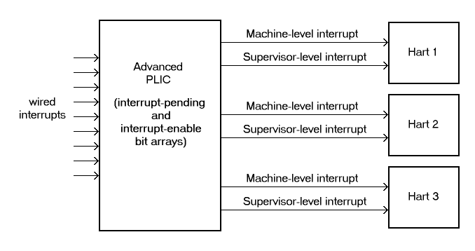

[[ch:intro]]
== Introduction

This document specifies the Advanced Interrupt Architecture for ,
consisting of: (a) an extension to the standard Privileged Architecture
for harts specified in Volume II of The Instruction Set Manual; (b) two
standard interrupt controllers for systems, an Advanced Platform-Level
Interrupt Controller (APLIC) and an Incoming Message-Signaled Interrupt
Controller (IMSIC); and (c) requirements on other system components
concerning interrupts.

[NOTE]
====
Commentary on our design decisions, implementation options, and
application is formatted as in this paragraph, and can be skipped if the
reader is only interested in the specification itself.
====

=== Goals

The Advanced Interrupt Architecture has these goals:

* Build upon the interrupt-handling functionality of the Privileged
Architecture, minimizing the replacement of existing functionality.
* Provide facilities for systems to work directly with message-signaled
interrupts (MSIs) as employed by PCI Express and other device standards,
in addition to basic wired interrupts.
* For wired interrupts, define a new Platform-Level Interrupt Controller
(the Advanced PLIC, or APLIC) that has an independent control interface
for each level of privilege (such as machine and supervisor levels), and
that can convert wired interrupts into MSIs for systems supporting MSIs.
* Expand the framework for local interrupts at a hart.
* Optionally allow software to configure the relative priorities of all
sources of interrupts to a hart (including the standard timer and
software interrupts, among others), instead of being limited just to the
ability of a separate interrupt controller to prioritize external
interrupts only.
* When harts implement the Privileged Architecture’s hypervisor
extension, provide sufficient assistance for virtualizing these same
interrupt facilities for virtual machines.
* With the help of an IOMMU (I/O memory management unit) for redirecting
MSIs, maximize the opportunities and ability for a guest operating
system running in a virtual machine to have direct control of devices
with minimal involvement of a hypervisor.
* Avoid having the interrupt hardware be a limiter on the number of
virtual machines.
* Achieve all of the above with the best possible compromises between
speed, efficiency, and flexibility of implementation.

This initial version of the Advanced Interrupt Architecture is focused
primarily on the needs of larger, high-performance systems. Support is
not currently defined for the following interrupt-handling features that
are useful for minimizing interrupt response times in so-called
"real-time" systems but are less appropriate for high-speed processor
cores:

* the option to give each interrupt source at a hart a separate trap entry
address;

* automatic stacking of register values on interrupt trap entry, and
restoration on exit; and

* automatic preemption (nesting) of interrupts at a hart, based on
priority.

It is intended that such features optimizing for smaller and/or
real-time systems can be developed as a follow-on extension, either
separately or as part of a future version of the interrupt architecture
of this document.

=== Limits

In its current version, the Advanced Interrupt Architecture can support
symmetric multiprocessing (SMP) systems with up to 16,384 harts. If the
harts are 64-bit (RV64) and implement the hypervisor extension, and if
all features of the Advanced Interrupt Architecture are fully
implemented as well, then for each physical hart there may be up to 63
active virtual harts and potentially thousands of additional idle
(swapped-out) virtual harts, where each virtual hart has direct control
of one or more physical devices.

<<overalllimits>> summarizes the main limits
on the numbers of harts, both physical and virtual, and the numbers of
distinct interrupt identities that may be supported with the Advanced
Interrupt Architecture.

[NOTE]
====
We assume that any single computer (or any single node in a cluster or
distributed system) with many thousands of physical harts will probably
need an interrupt infrastructure adapted to the machine’s specific
organization, which we do not attempt to predict.
====

[[overalllimits]]
.Absolute limits on the numbers of harts and interrupt identities in a system.  Individual implementations are likely to have smaller limits.
[cols="<,^,<",options="header",]
|===
| |Maximum |Requirements
|Physical harts |16,384 |

|Active virtual harts having direct control of a device, per physical hart |31 for RV32, 63 for RV64 |RISC-V hypervisor extension; IMSICs with guest interrupt files; and an IOMMU

|Idle (swapped-out) virtual harts having direct control of a device, per physical hart |potentially thousands |An IOMMU with support for memory-resident interrupt files

| Wired interrupts at a single APLIC |1023 |

|Distinct identities usable for MSIs at each hart (physical or virtual) |2047 |IMSICs

|===

=== Overview of main components

A system’s overall architecture for signaling interrupts depends on
whether it is built mainly for message-signaled interrupts (MSIs) or for
more traditional wired interrupts. In systems with full support for
MSIs, every hart has an _Incoming MSI Controller_ (IMSIC) that serves as
the hart’s own private interrupt controller for external interrupts.
Conversely, in systems based primarily on traditional wired interrupts,
harts do not have IMSICs. Larger systems, and especially those with PCI
devices, are expected to fully support MSIs by giving harts IMSICs,
whereas many smaller systems may continue to be best served with wired
interrupts and simpler harts without IMSICs.

==== External interrupts without IMSICs

When harts do not have Incoming MSI Controllers, external interrupts are
signaled to harts through dedicated wires. In that case, an _Advanced
Platform-Level Interrupt Controller_ (APLIC) acts as a traditional
central hub for interrupts, routing and prioritizing external interrupts
for each hart as illustrated in <<intrsWithoutIMSICs>>.
Interrupts may be selectively routed either to machine level or to
supervisor level at each hart. The APLIC is specified in
<<AdvPLIC>>.

[[intrsWithoutIMSICs]]
.Traditional delivery of wired interrupts to harts without support for MSIs.

Without IMSICs, the current Advanced Interrupt Architecture does not
support the direct signaling of external interrupts to virtual machines,
even when harts implement the Privileged Architecture’s hypervisor
extension. Instead, an interrupt must be sent to the relevant
hypervisor, which can then choose to inject a virtual interrupt into the
virtual machine.

If harts implement the hypervisor extension, it is a topic of ongoing
study whether an APLIC should be allowed to route external interrupts to
be the _guest external interrupts_ of the hypervisor extension,
permitting the delivery of interrupts directly to virtual machines
without the need for each signaled interrupt to be handled at the
hypervisor level. For now, we assume that systems that need direct
signaling of external interrupts to virtual machines will have IMSICs.

image::intrsWithIMSICs.png[ Interrupt delivery by MSIs when harts have
IMSICs for receiving them. ]

==== External interrupts with IMSICs

To be able to receive message-signaled interrupts (MSIs), each hart must
have an Incoming MSI Controller (IMSIC) as shown in
Figure #fig:intrsWithIMSICs[1.2]. Fundamentally, a message-signaled
interrupt is simply a memory write to a specific address that hardware
accepts as indicating an interrupt. To that end, every IMSIC is assigned
one or more distinct addresses in the machine’s address space, and when
a write is made to one of those addresses in the expected format, the
receiving IMSIC interprets the write as an external interrupt for the
respective hart.

Because all IMSICs have unique addresses in the machine’s physical
address space, every IMSIC can receive MSI writes from any agent (hart
or device) with permission to write to it. IMSICs have separate
addresses for MSIs directed to machine and supervisor levels, in part so
the ability to signal interrupts at each privilege level can be
separately granted or denied by controlling write permissions at the
different addresses, and in part to better support virtualizability
(pretending that one privilege level is a higher level). MSIs intended
for a hart at a specific privilege level are recorded within the IMSIC
in an _interrupt file_, which consists mainly of an array of
interrupt-pending bits and a matching array of interrupt-enable bits,
the latter indicating which individual interrupts the hart is currently
prepared to receive.

IMSIC units are fully defined in Chapter #ch:IMSIC[[ch:IMSIC]]. The
format of MSIs used by the Advanced Interrupt Architecture is described
in that chapter, Section #sec:MSIEncoding[[sec:MSIEncoding]].

When the harts in a system have IMSICs, the system will normally still
contain an APLIC, but its role is changed. Instead of signaling
interrupts to harts directly by wires as in
Figure #fig:intrsWithoutIMSICs[1.1], an APLIC converts incoming wired
interrupts into MSI writes that are sent to harts via their IMSIC units.
Each MSI is sent to a single target hart according to the APLIC’s
configuration set by software.

If harts implement the Privileged Architecture’s hypervisor extension,
IMSICs may have additional _guest interrupt files_ for delivering
interrupts to virtual machines. Besides Chapter #ch:IMSIC[[ch:IMSIC]] on
the IMSIC, see Chapter #ch:VSLevel[[ch:VSLevel]] which specifically
covers interrupts to virtual machines. If the system also contains an
IOMMU to perform address translation of memory accesses made by I/O
devices, then MSIs from those same devices may require special handling.
This topic is addressed in Chapter #ch:IOMMU[[ch:IOMMU]], ``IOMMU
Support for MSIs to Virtual Machines.''

==== Other interrupts

In addition to external interrupts from I/O devices, the Privileged
Architecture specifies a few other major classes of interrupts for
harts. The Privileged Architecture’s timer interrupts remain supported
in full, and software interrupts remain at least partly supported,
although neither appears in Figures #fig:intrsWithoutIMSICs[1.1]
and #fig:intrsWithIMSICs[1.2]. For the specifics on software interrupts,
refer to Chapter #ch:IPIs[[ch:IPIs]], ``Interprocessor Interrupts
(IPIs).''

The Advanced Interrupt Architecture adds considerable support for _local
interrupts_ at a hart, whereby a hart essentially interrupts itself in
response to asynchronous events, usually errors. Local interrupts remain
contained within a hart (or close to it), so like standard timer and
software interrupts, they do not pass through an APLIC or IMSIC.

=== Interrupt identities at a hart

The Privileged Architecture gives every interrupt cause at a hart a
distinct _major identity number_, which is the Exception Code
automatically written to CSR or on an interrupt trap. Interrupt causes
that are standardized by the Privileged Architecture have major
identities in the range 0–15, while numbers 16 and higher are officially
available for platform standards or for custom use. The Advanced
Interrupt Architecture claims further authority over identity numbers in
the ranges 16–23 and 32–47, leaving numbers in the range 24–31 and all
major identities 48 and higher still free for custom use.
Table #tab:interruptIdents[[tab:interruptIdents]] characterizes all
major interrupt identities with this extension.

[cols="^,^,<",options="header",]
|===
|Major identity |Minor identity |
|0 |– |_Reserved by Privileged Architecture_
|1 |– |Supervisor software interrupt
|2 |– |Virtual supervisor software interrupt
|3 |– |Machine software interrupt
|4 |– |_Reserved by Privileged Architecture_
|5 |– |Supervisor timer interrupt
|6 |– |Virtual supervisor timer interrupt
|7 |– |Machine timer interrupt
|8 |– |_Reserved by Privileged Architecture_
|9 |Determined by |Supervisor external interrupt
|10 | external interrupt |Virtual supervisor external interrupt
|11 | controller |Machine external interrupt
|12 |– |Supervisor guest external interrupt
|13 |– |Counter overflow interrupt
|14–15 |– |_Reserved by Privileged Architecture_
|16–23 |– |_Reserved for standard local interrupts_
|24–31 |– |_Designated for custom use_
|32–34 |– |_Reserved for standard local interrupts_
|35 |– |Low-priority RAS event interrupt
|36–42 |– |_Reserved for standard local interrupts_
|43 |– |High-priority RAS event interrupt
|44–47 |– |_Reserved for standard local interrupts_
|latexmath:[$\geq \mbox{48}$] |– |_Designated for custom use_
|===

Interrupts from most I/O devices are conveyed to a hart by the _external
interrupt controller_ for the hart, which is either the hart’s IMSIC
(Figure #fig:intrsWithIMSICs[1.2]) or an APLIC
(Figure #fig:intrsWithoutIMSICs[1.1]). As
Table #tab:interruptIdents[[tab:interruptIdents]] shows, external
interrupts at a given privilege level all share a single major identity
number: 11 for machine level, 9 for supervisor level, and 10 for
VS-level. External interrupts from different causes are distinguished
from one another at a hart by their _minor identity numbers_ supplied by
the external interrupt controller.

Other interrupt causes besides external interrupts might also have their
own minor identities. However, this document has need to discuss minor
identities only with regard to external interrupts.

The local interrupts defined by the Advanced Interrupt Architecture and
their handling are covered mainly in Chapter #ch:MSLevel[[ch:MSLevel]],
``Interrupts for Machine and Supervisor Levels.''

=== Selection of harts to receive an interrupt

Each signaled interrupt is delivered to only one hart at one privilege
level, usually determined by software in one way or another. Unlike some
other architectures, the Advanced Interrupt Architecture provides no
standard hardware mechanism for the broadcast or multicast of interrupts
to multiple harts.

For local interrupts, and for any ``virtual'' interrupts that software
injects into lower privilege levels at a hart, the interrupts are
entirely a local affair at the hart and are never visible to other
harts. The Privileged Architecture’s timer interrupts are also uniquely
tied to individual harts. For other interrupts, received by a hart from
sources outside the hart, each interrupt signal (whether delivered by
wire or by an MSI) is configured by software to go to only a single
hart.

To send an interprocessor interrupt (IPI) to multiple harts, the
originating hart need only execute a loop, sending an individual IPI to
each destination hart. For IPIs to a single destination hart, see
Chapter #ch:IPIs[[ch:IPIs]].

The effort that a source hart expends in sending individual IPIs to
multiple destinations will invariably be dwarfed by the combined effort
at the receiving harts to handle those interrupts. Hence, providing an
automated mechanism for IPI multicast could be expected to reduce a
system’s total overall work only modestly at best. With a very large
number of harts, a hardware mechanism for IPI multicast must contend
with the question of how exactly software specifies the intended
destination set with each use, and furthermore, the actual physical
delivery of IPIs may not differ that much from the software version.

We do not exclude the future possibility of an optional hardware
mechanism for multicast IPI, but only if a significant advantage can be
demonstrated in real use. As of 2020, Linux has been observed not to
make use of multicast IPI hardware even on systems that have it.

In the rare event that a single interrupt from an I/O device needs to be
communicated to multiple harts, the interrupt must be sent to a single
hart which can then signal the other harts by IPIs.

We contend that the need to communicate an I/O interrupt to multiple
harts is sufficiently rare that standardizing hardware support for
multicast cannot be justified in this case.

Along with multicast delivery, other architectures support an option for
``1-of-latexmath:[$N$]'' delivery of interrupts, whereby the hardware
chooses a single destination hart from among a configured set of
latexmath:[$N$] harts, with the goal of automatic load balancing of
interrupt handling among the harts. Experiments in the 2010s called into
question the utility of 1-of-latexmath:[$N$] modes in practice, showing
that software could often do a better job of load balancing than the
hardware algorithms implemented in actual chips. Linux was consequently
modified to discontinue using 1-of-latexmath:[$N$] interrupt delivery
even on systems that have it.

We remain open to the argument that hardware load balancing of interrupt
handling may be beneficial for certain specialized markets, such as
networking. However, the claims made so far in this regard do not
justify requiring support for 1-of-latexmath:[$N$] delivery in all
servers. With more evidence, some mechanism for 1-of-latexmath:[$N$]
delivery might become a future option.

The original Platform-Level Interrupt Controller (PLIC) for is
configurable so each interrupt source signals external interrupts to any
subset of the harts, potentially all harts. When multiple harts receive
an external interrupt from a single cause at the PLIC, the first hart to
_claim_ the interrupt at the PLIC is the one responsible for servicing
it. Usually this sets up a race, where the subset of harts configured to
receive the multicast interrupt all take an external interrupt trap
simultaneously and compete to be the first to claim the interrupt at the
PLIC. The intention is to provide a form of 1-of-latexmath:[$N$]
interrupt delivery. However, for all the harts that fail to win the
claim, the interrupt trap becomes wasted effort.

For the reasons already given, the Advanced PLIC supports sending each
signaled interrupt to only a single hart chosen by software, not to
multiple harts.

=== ISA extensions Smaia and Ssaia

The Advanced Interrupt Architecture (AIA) defines two names for
extensions to the instruction set architecture (ISA), one for
machine-level execution environments, and another for supervisor-level
environments. For a machine-level environment, extension *Smaia*
encompasses all added CSRs and all modifications to interrupt response
behavior that the AIA specifies for a hart, over all privilege levels.
For a supervisor-level environment, extension *Ssaia* is essentially the
same as Smaia except excluding the machine-level CSRs and behavior not
directly visible to supervisor level.

Extensions Smaia and Ssaia cover only those AIA features that impact the
ISA at a hart. Although the following are described or discussed in this
document as part of the AIA, they are not implied by Smaia or Ssaia
because the components are categorized as non-ISA: APLICs, IOMMUs, and
any mechanisms for initiating interprocessor interrupts apart from
writing to IMSICs.

As revealed in subsequent chapters, the exact set of CSRs and behavior
added by the AIA, and hence implied by Smaia or Ssaia, depends on the
base ISA’s XLEN (RV32 or RV64), on whether S-mode and the hypervisor
extension are implemented, and on whether the hart has an IMSIC. But
individual AIA extension names are not provided for each possible valid
subset. Rather, the different combinations are inferable from the
intersection of features indicated (such as RV64I + S-mode + Smaia, but
without the hypervisor extension).

Software development tools like compilers and assemblers need not be
concerned about whether an IMSIC exists but should just allow attempts
to access the IMSIC CSRs (described in Chapters #ch:CSRs[[ch:CSRs]]
and #ch:IMSIC[[ch:IMSIC]]) if Smaia or Ssaia is indicated. Without an
actual IMSIC, such attempts may trap, but that is not a problem for the
development tools.
